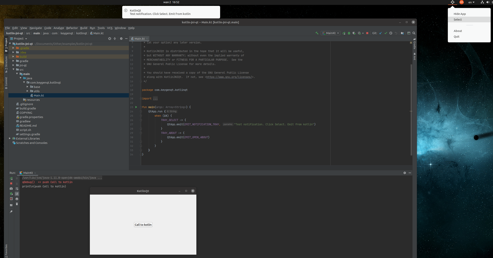

KotlinJNIQt
===================

An example of a combination of [kotlin](https://kotlinlang.org/) + [JNI](https://docs.oracle.com/javase/8/docs/technotes/guides/jni/) + [Qt](https://www.qt.io/)

### Problem
Qt License - [GNU General Public License](https://www.gnu.org/licenses/)

### Idea:
Kotlin - base language for make application

Qt - GUI interface linked like library

JNI - connecting link

### Implemented

#### Connect
- Listener kotlin -> qt
- Listener qt -> kotlin

#### In Example
- Run app (kotlin)
- Main Window (qt)
- Dialog (qt)
- System tray (qt)
- Send data qt -> kotlin (qt)
- Send data kotlin -> qt (kotlin)
- Call notification from kotlin -> qt (kotlin)

